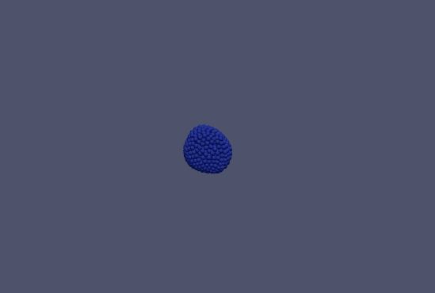

ya||a
=====

ya||a is yet another parallel agent-based model for morphogenesis, like the following branching process:

ya||a extends the spheroid model by the addition of spin-like polarities to simulate epithelial sheets and tissue polarity using pair-wise interactions only. This design is simple and lends itself to parallelization and we implemented it together with recent models for protrusions and migration for GPUs for high performance. For further information see [10.1016/j.cels.2019.02.007](https://doi.org/10.1016/j.cels.2019.02.007).

The models can be compiled using [CUDAs](https://developer.nvidia.com/cuda-downloads) `$ nvcc -std=c++11 -arch=sm_XX model.cu` on Linux and macOS without further dependencies. The resulting executable can be run with `$ ./a.out` and produces [vtk files](http://www.vtk.org/wp-content/uploads/2015/04/file-formats.pdf) that can be visualized for instance with [ParaView](http://www.paraview.org/). The model  [`examples/springs.cu`](examples/springs.cu) is a good starting point to learn more.

ya||a is maintained at [github.com/germannp/yalla](https://github.com/germannp/yalla) and is freely available under the [MIT license](LICENSE).
