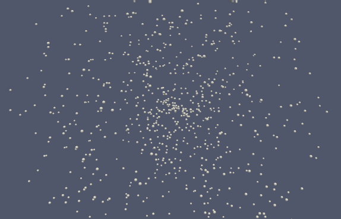

bolls
=====

Center-dynamics (aka spheroid) models like the following 800 bodies with springs between each other:

The models can be compiled using [CUDAs](https://developer.nvidia.com/cuda-downloads) `$ nvcc -std=c++11 model.cu` on Linux and macOS without further dependencies. The examples produce [vtk files](http://www.vtk.org/wp-content/uploads/2015/04/file-formats.pdf) that can be visualized for instance with [ParaView](http://www.paraview.org/). The model producing above simulation, [`examples/springs.cu`](examples/springs.cu), is a good starting point to learn more.
